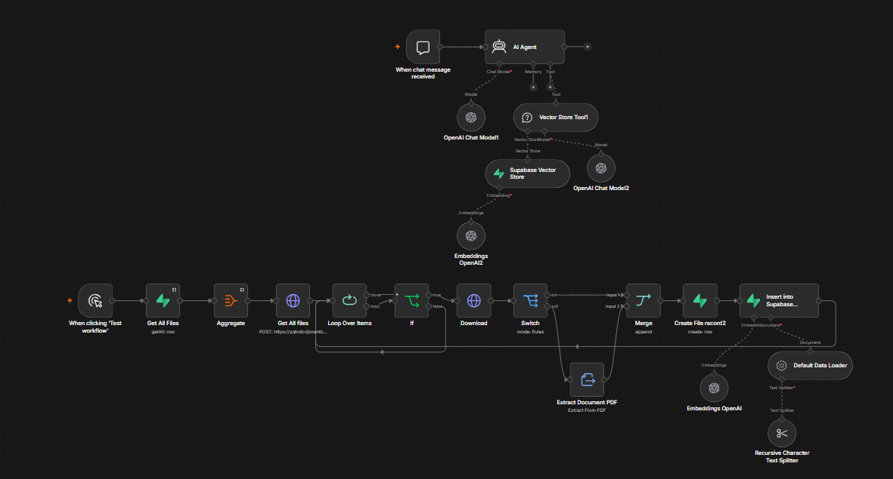
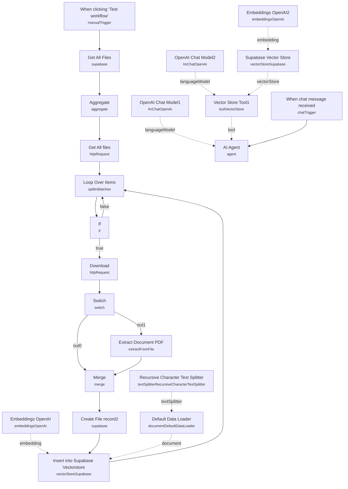

# Chat With Files in Supabase Storage

<!-- CANVAS:START -->

<!-- CANVAS:END -->

A two-part workflow that keeps a Supabase vector store in sync with files sitting in Supabase Storage, then exposes an AI chat agent that answers questions using those files as its knowledge base. New files are automatically detected, downloaded, chunked, embedded, and indexed — no manual re-upload step required.

Built for teams who already store documents in Supabase Storage and want a chatbot that can answer questions grounded in that content, without wiring up a separate document pipeline.

## What it does

**Scenario 1 — sync new files into the vector store (manual trigger):**

1. **When clicking 'Test workflow'** starts the sync run.
2. **Get All Files** (Supabase node, `getAll` on the `files` table) retrieves already-indexed file records, and **Aggregate** collapses them into one array for comparison.
3. **Get All files** (HTTP Request to Supabase Storage's `list` endpoint on the `private` bucket) lists everything currently in storage, and **Loop Over Items** processes them one at a time.
4. **If** checks two conditions: the file's storage ID isn't already present in the aggregated "already indexed" list, and its name isn't the `.emptyFolderPlaceholder` Supabase creates for empty folders. Matches proceed; everything else loops back without action.
5. **Download** (HTTP Request to Supabase Storage's object endpoint) fetches the new file's binary, and **Switch** branches on file extension: files with no extension are treated as `txt`, files ending in `.pdf` go to **Extract Document PDF** (`extractFromFile`, PDF operation).
6. Both branches converge at **Merge**, then **Create File record2** (Supabase, insert into `files` table) logs the new file's `name` and `storage_id`.
7. **Insert into Supabase Vectorstore** (`vectorStoreSupabase`, insert mode, table `documents`) embeds the content using **Embeddings OpenAI** (text-embedding-3-small) with **Default Data Loader** (tagging each chunk with `file_id` metadata) and **Recursive Character Text Splitter** (500-token chunks, 200-token overlap), then loops back to process the next file.

**Scenario 2 — AI agent (chat trigger):**

1. **When chat message received** opens a chat session.
2. **AI Agent** (backed by **OpenAI Chat Model1**) answers using **Vector Store Tool1** ("knowledge_base", top-8 retrieval, described as "Retrieve data about user request"), which queries **Supabase Vector Store** (same `documents` table, filtered by a hardcoded `file_id` metadata value in this template) with embeddings from **Embeddings OpenAI2** and query composition from **OpenAI Chat Model2**.

## Sample request

This uses n8n's built-in chat trigger. Once connected, a user simply asks a question in the chat panel:

```
What does the onboarding policy document say about probation periods?
```

The agent will only see chunks that match the `file_id` metadata configured on **Supabase Vector Store** — see the setup note below about scoping this to "all files" versus a specific document.

## Setup (~20 minutes)

1. **Supabase** — add a Supabase API credential to **Get All Files**, **Get All files**, **Download**, **Create File record2**, **Insert into Supabase Vectorstore**, and **Supabase Vector Store**. Replace the hardcoded storage URL (`https://yqtvdcvjboenlblgcivl.supabase.co/storage/v1/object/...`) in **Get All files** and **Download** with your own Supabase project URL, and adjust the `private` bucket name if yours differs.
2. **Supabase tables** — create a `files` table (columns: `name`, `storage_id`) and a `documents` table matching Supabase's standard `vectorStoreSupabase` schema (with a `match_documents` query function), matching the table names referenced in **Get All Files**, **Create File record2**, **Insert into Supabase Vectorstore**, and **Supabase Vector Store**.
3. **OpenAI** — add API keys to **Embeddings OpenAI**, **Embeddings OpenAI2**, **OpenAI Chat Model1**, and **OpenAI Chat Model2**. Note the workflow ships with three different named OpenAI credentials across nodes ("OpenAi account", "OpenAi club", "Test club key") — consolidate to a single key.
4. **Hardcoded `file_id` filter** — the **Supabase Vector Store** node (used by the chat agent's retrieval tool) has a metadata filter hardcoded to one specific `file_id` (`300b0128-0955-4058-b0d3-a9aefe728432`) left over from testing. Remove or generalize this filter so the agent searches across all indexed documents rather than just one leftover test file.
5. **Text file handling** — the Switch node's `txt` branch has no extraction node wired to it in this template (it falls through empty); you'll need to add a text-extraction step (or confirm your text files are small enough to embed as raw binary) if you expect non-PDF uploads.
6. **Duplicate-detection logic** — the **If** node's dedup check reads from `$('Aggregate').item.json.data`, which requires **Aggregate** to run once per full **Loop Over Items** pass; if you significantly restructure the workflow, keep this reference intact or new-file detection will break.

---

<!-- ARCHITECTURE:START -->
## Architecture


<!-- ARCHITECTURE:END -->
