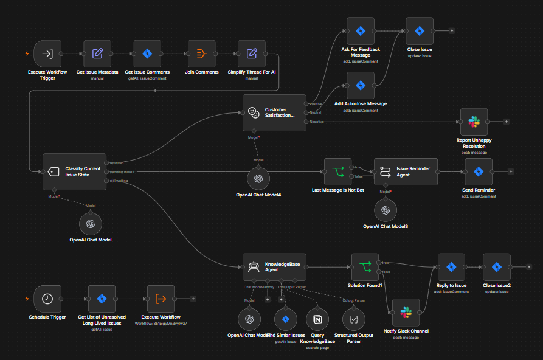
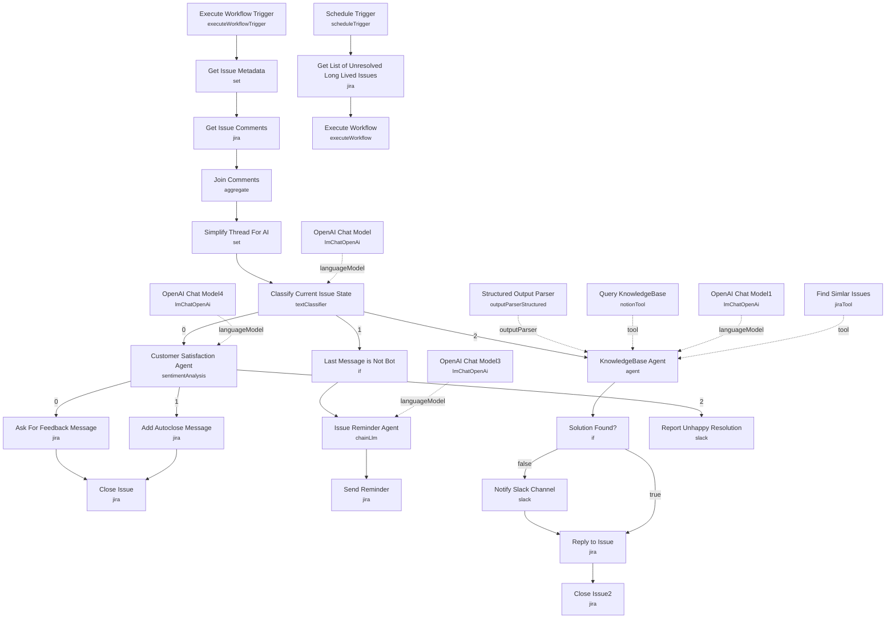

# Customer Support Issue Classifier & Resolution

<!-- CANVAS:START -->

<!-- CANVAS:END -->

A scheduled housekeeping workflow for JIRA-based support queues that finds tickets no one has touched in a week, figures out what state each one is actually in, and takes the appropriate action automatically — closing resolved tickets, attempting an AI-generated resolution for untouched ones, or nudging participants on stalled ones.

Built for support or engineering teams drowning in long-lived JIRA tickets that need triage but not necessarily a human for every single one.

## What it does

1. **Schedule Trigger** runs daily and calls **Get List of Unresolved Long Lived Issues** (JIRA node), which searches with JQL `status IN ("To Do", "In Progress") AND created <= -7d`.
2. **Execute Workflow** re-invokes this same workflow (`$workflow.id`) once per issue in parallel via **Execute Workflow Trigger**, which then calls **Get Issue Metadata** (Set node) to normalize the JIRA issue into `key`, `title`, `url`, `date`, `reporter`, `reporter_url`, `reporter_accountId`, and `description`.
3. **Get Issue Comments** (JIRA) fetches the full comment thread, and **Join Comments** aggregates it; **Simplify Thread For AI** (Set) flattens the JIRA rich-text comment structure into a plain-text `thread` array and a `topic` summary string.
4. **Classify Current Issue State** (`textClassifier`, backed by **OpenAI Chat Model**) buckets the issue into one of three categories: `resolved`, `pending more information`, or `still waiting` (no human comments yet, ignoring bot messages).
5. **Resolved branch:** **Customer Satisfaction Agent** (`sentimentAnalysis`, via **OpenAI Chat Model4**) scores the thread's sentiment. Positive sentiment → **Ask For Feedback Message** (JIRA comment asking for a review) → **Close Issue**. Negative sentiment → **Report Unhappy Resolution** (Slack alert to a hardcoded channel) with no auto-close. Neutral/other → **Add Autoclose Message** → **Close Issue**.
6. **Still-waiting branch:** **KnowledgeBase Agent** (`@n8n/n8n-nodes-langchain.agent`, via **OpenAI Chat Model1**, with a **Structured Output Parser** enforcing `solution_found` / `short_summary_of_issue` / `response`) tries to answer the ticket using two tools: **Find Simlar Issues** (a JIRA search tool for related resolved tickets) and **Query KnowledgeBase** (a Notion search tool). **Solution Found?** then branches: if solved, **Reply to Issue** posts the AI's answer as a comment and **Close Issue2** closes it; if not, **Notify Slack Channel** posts a summary to Slack before also replying and closing.
7. **Pending-more-information branch:** **Last Message is Not Bot** checks whether the last comment was human-authored (not an automated message). If true, **Issue Reminder Agent** (`chainLlm`, via **OpenAI Chat Model3**) drafts a short reminder summarizing what's pending, and **Send Reminder** posts it as a JIRA comment.

## Sample request

There's no external trigger payload here — the entry point is **Schedule Trigger** (interval-based, runs on its own). The only "input" a user configures is the JQL query inside **Get List of Unresolved Long Lived Issues**:

```
status IN ("To Do", "In Progress") AND created <= -7d
```

Adjust the `-7d` threshold or status list to match your own definition of "long-lived."

## Setup (~20 minutes)

1. **JIRA** — add a JIRA Software Cloud credential to every JIRA node: **Get Issue Comments**, **Close Issue**, **Send Reminder**, **Add Autoclose Message**, **Ask For Feedback Message**, **Reply to Issue**, **Close Issue2**, **Get Issue Metadata**'s source **Get List of Unresolved Long Lived Issues**, and the **Find Simlar Issues** tool node.
2. **OpenAI** — add an API key to all five OpenAI Chat Model nodes (**OpenAI Chat Model** through **OpenAI Chat Model4**), used respectively for classification, the knowledgebase agent, the reminder chain, sentiment analysis, and (indirectly) shared config.
3. **Notion** — add a Notion API credential to the **Query KnowledgeBase** tool node, and confirm the connected integration has access to whatever pages/databases hold your support documentation.
4. **Slack** — add a Slack API credential to **Notify Slack Channel** and **Report Unhappy Resolution**. Both hardcode a channel ID (`C07S0NQ04D7`, `n8n-jira`) — change this to your own support/escalation channel.
5. **Hardcoded JIRA status ID** — **Close Issue** and **Close Issue2** both set `statusId: "31"` (cached as "Done"). This ID is specific to the original JIRA project's workflow scheme; look up the correct transition/status ID for your own project before relying on this.
6. **Self-referencing sub-workflow** — **Execute Workflow** calls `$workflow.id`, i.e. this same workflow, to process each issue independently via **Execute Workflow Trigger**. Don't rename or fork the workflow without verifying that reference still resolves.
7. **Review link placeholder** — the **Ask For Feedback Message** comment includes a literal `link/to/review_site` placeholder; replace it with your actual review link before enabling.

---

<!-- ARCHITECTURE:START -->
## Architecture


<!-- ARCHITECTURE:END -->
