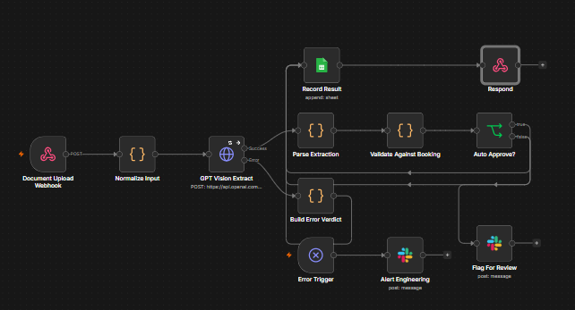
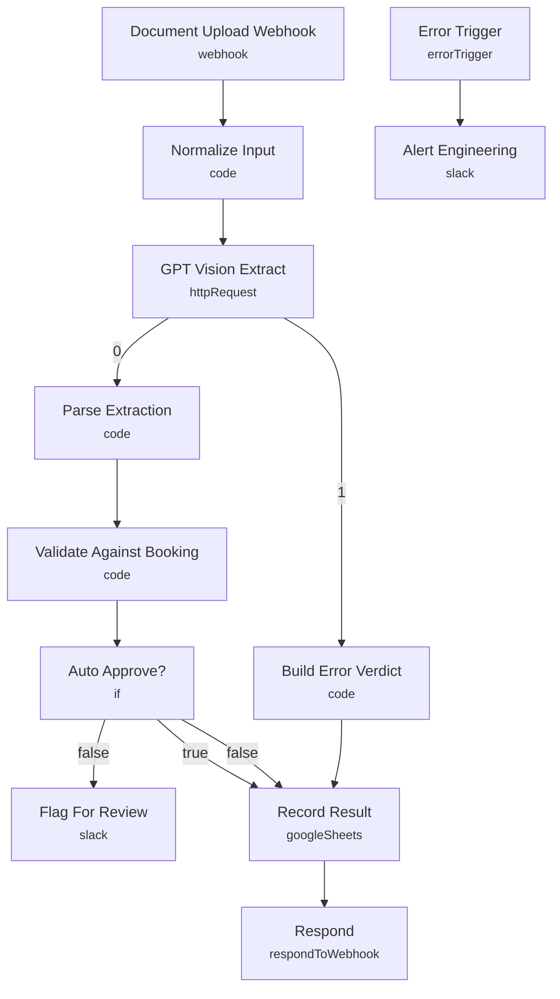

# Vision AI Receipt & Document Verification

<!-- CANVAS:START -->

<!-- CANVAS:END -->

A Vision AI pipeline that reads a receipt or invoice image with GPT 4o Vision, validates the extracted total and currency against the expected booking values, auto approves clean documents, flags the rest for human review, and logs every result to Google Sheets.

Built for hospitality finance and operations teams that need to verify guest receipts, deposits and supplier invoices at scale.

## What it does

1. **Document Upload Webhook** receives the document image URL plus the expected amount and currency.
2. **Normalize Input** cleans the payload into a consistent shape.
3. **GPT Vision Extract** calls the OpenAI vision API to read the document into structured JSON, retrying on failure.
4. **Parse Extraction** safely parses the model output into typed fields.
5. **Validate Against Booking** checks total, currency and confidence against the expected values within a 2 percent tolerance and assigns a verdict.
6. **Auto Approve?** branches on whether the verdict is APPROVED.
7. **Flag For Review** posts non approved documents to the finance review channel.
8. **Build Error Verdict** turns a failed vision call into an ERROR verdict so nothing is silently dropped.
9. **Record Result** appends the full result to Google Sheets, and **Respond** returns the verdict to the caller.
10. **Error Trigger** plus **Alert Engineering** catch any unhandled failure.

## Sample request

Send a POST to the webhook with a body like this:

```json
{
  "document_id": "rcpt_1024",
  "guest_id": "g_55",
  "booking_id": "BK_2231",
  "image_url": "https://example.com/receipt.jpg",
  "expected_amount": 240.00,
  "currency": "EUR"
}
```

The image URL must be publicly reachable by the OpenAI API.

## Verdicts

- **APPROVED** all checks passed within tolerance.
- **REVIEW** a mismatch worth a human look, such as an amount outside tolerance.
- **REJECTED** low confidence or a missing total.
- **ERROR** the vision call failed after retries.

## Setup (about 10 minutes)

1. **OpenAI** connect your key in the GPT Vision Extract node.
2. **Slack** connect your account in Flag For Review and Alert Engineering.
3. **Google Sheets** connect in Record Result and set your sheet id with a tab named Verifications.

## Error handling

The vision call retries on a transient failure and has its own error output that routes to an explicit ERROR verdict, so a failed extraction is still logged rather than lost. A global Error Trigger alerts the team on any unhandled failure.

---

<!-- ARCHITECTURE:START -->
## Architecture


<!-- ARCHITECTURE:END -->
