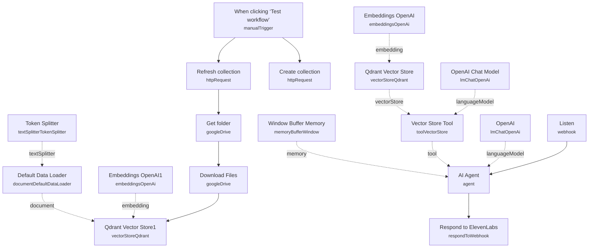

# AI Voice Chatbot for Restaurants (ElevenLabs)

A voice-based ordering/FAQ assistant for a restaurant, pairing an ElevenLabs conversational voice agent with an n8n-hosted RAG backend. ElevenLabs handles speech-to-text and text-to-speech; n8n handles the actual knowledge lookup and answer generation, exposed to ElevenLabs as a tool the voice agent calls mid-conversation.

Built for restaurants (or similar small businesses) that want a phone- or website-based voice assistant answering menu, hours, and general questions from their own documents, without hand-writing a rules-based IVR script.

## What it does

1. **Listen** is a webhook (`test_voice_message_elevenlabs`, POST) that ElevenLabs calls whenever its voice agent needs an answer, passing the transcribed question in the request body.
2. **AI Agent** receives `body.question` as its input. It has no memory-less setup beyond **Window Buffer Memory** for short conversational context and **OpenAI** as its language model.
3. **Vector Store Tool** ("company") is the agent's only tool: it retrieves relevant chunks from **Qdrant Vector Store** using **OpenAI Chat Model** to formulate the retrieval query and **Embeddings OpenAI** for vector search.
4. **AI Agent** composes a natural-language answer from the retrieved context and returns it via **Respond to ElevenLabs**, which sends the JSON response back to the ElevenLabs webhook tool call. ElevenLabs then converts the text answer to speech for the caller.

**Knowledge base ingestion (manual trigger, run separately before going live):**

1. **When clicking 'Test workflow'** starts ingestion.
2. **Create collection** and **Refresh collection** are HTTP Request calls against the Qdrant REST API.
3. **Get folder** (Google Drive) lists files in a source folder; **Download Files** fetches each one.
4. **Qdrant Vector Store1** (insert mode) embeds and stores the documents, using **Embeddings OpenAI1**, **Token Splitter**, and **Default Data Loader** to chunk and load content (menu PDFs, FAQ docs, etc.).

## Sample request

The trigger is a webhook called by ElevenLabs' voice agent tool integration, not something a browser calls directly. The expected payload to **Listen** is:

```json
{
  "question": "Do you have any gluten-free pizza options?"
}
```

To test without a live phone call, POST this JSON to the workflow's production webhook URL directly and confirm you get back a JSON response with the generated answer.

## Setup (~30 minutes)

1. **ElevenLabs** (external to n8n) — create a conversational agent, give it a first message and a system prompt telling it to call a tool (e.g. `test_chatbot_elevenlabs`) whenever it needs restaurant-specific information, storing the caller's question in a `question` body parameter, and point that tool at this workflow's **Listen** webhook URL (POST).
2. **OpenAI** — add your API key to **OpenAI**, **OpenAI Chat Model**, **Embeddings OpenAI**, and **Embeddings OpenAI1**.
3. **Qdrant** — add API credentials (header auth) to **Create collection**, **Refresh collection**, **Qdrant Vector Store**, and **Qdrant Vector Store1**. Replace the `QDRANTURL` and `COLLECTION` placeholders in the HTTP Request URLs and the vector store collection fields.
4. **Google Drive** — add OAuth2 credentials to **Get folder** and **Download Files**, pointed at your menu/FAQ document folder (currently set to a folder literally named `test-whatsapp`, left over from a related template — rename the filter to your actual folder).
5. **Run ingestion first** — trigger **When clicking 'Test workflow'** once to populate Qdrant with your restaurant's documents before the voice agent goes live.
6. **Embed the widget** — once the agent is created on ElevenLabs, add the provided `<elevenlabs-convai>` widget snippet to your website, substituting your real `agent-id`.
7. **Rewrite the persona** — the sticky notes show a sample system prompt written for "Pizzeria da Michele"; replace it with your own restaurant's name, tone, and menu specifics on the ElevenLabs agent side.

---

<!-- ARCHITECTURE:START -->
## Architecture


<!-- ARCHITECTURE:END -->
