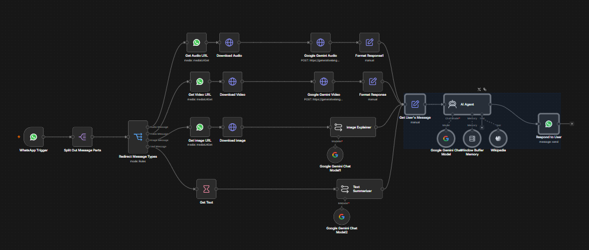
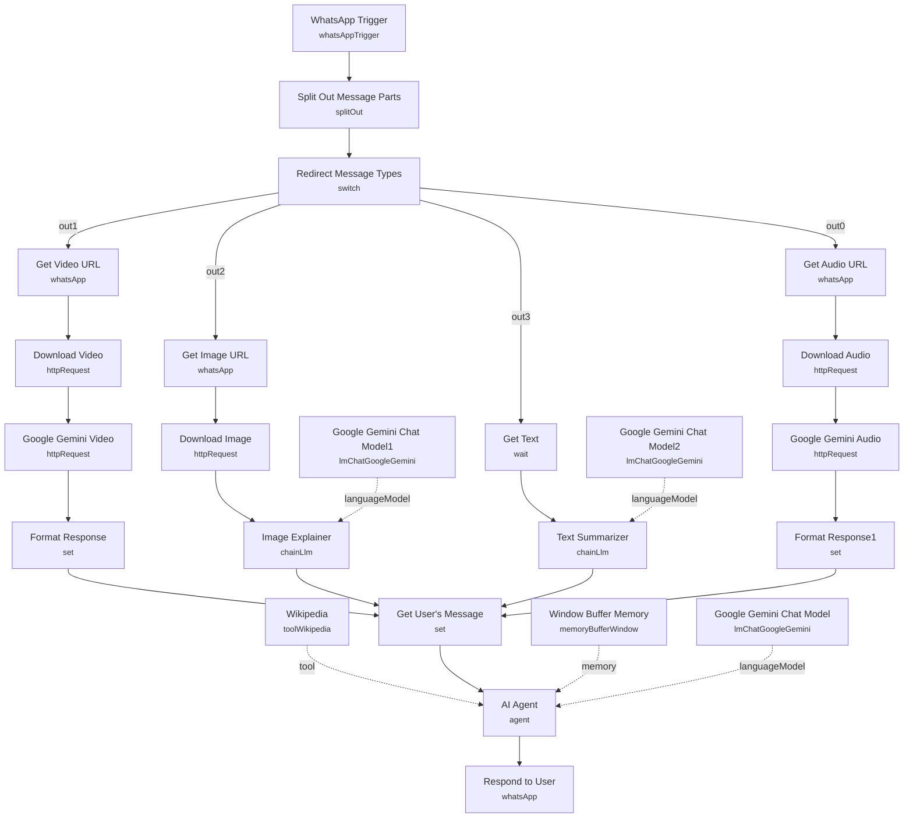

# WhatsApp AI Auto-Responder

<!-- CANVAS:START -->

<!-- CANVAS:END -->

A WhatsApp chatbot that accepts text, audio, image, and video messages, normalizes each media type into text the LLM can reason over, and replies through a general-knowledge AI agent backed by a Wikipedia tool.

Built as a foundation for any WhatsApp-based assistant — customer support, appointment booking, document triage — where the immediate need is handling all four WhatsApp message types cleanly before layering in business-specific logic.

## What it does

1. **WhatsApp Trigger** listens for incoming `messages` updates from the WhatsApp Business API.
2. **Split Out Message Parts** splits the trigger payload's `messages` array into individual items.
3. **Redirect Message Types** (switch) inspects `type` and routes to one of four branches, falling back to "Text Message" if none of the typed conditions match:
   - **Audio Message** → **Get Audio URL** (WhatsApp node, media `get` operation) → **Download Audio** (HTTP request with WhatsApp auth) → **Google Gemini Audio** (HTTP request to Gemini's multimodal API) transcribes the voice note → **Format Response1**.
   - **Video Message** → **Get Video URL** → **Download Video** → **Google Gemini Video** (HTTP request, since n8n's LLM nodes don't natively accept video binaries) describes the clip → **Format Response**.
   - **Image Message** → **Get Image URL** → **Download Image** → **Image Explainer** (an LLM chain using **Google Gemini Chat Model1**) describes the picture's contents.
   - **Text Message** (fallback) → **Get Text** (a zero-duration Wait node used purely to route to the next step) → **Text Summarizer** (an LLM chain using **Google Gemini Chat Model2**) lightly rephrases/summarizes the text.
4. All four branches converge on **Get User's Message**, which assembles a common record: `message_type`, `message_text` (the transcription/description/summary), `from` (sender's WhatsApp number, pulled from the original trigger payload), and `message_caption` (any caption attached to audio/video/image).
5. **AI Agent** (LangChain agent) receives this normalized message, using **Google Gemini Chat Model** as its LLM, **Window Buffer Memory** for conversation history, and the **Wikipedia** tool for factual lookups. Its system prompt frames it as "a general knowledge assistant made available to the public via whatsapp."
6. **Respond to User** sends the agent's `output` back to the original sender via the WhatsApp node, using the sender's number captured from **WhatsApp Trigger**.

## Sample request

This workflow is driven entirely by WhatsApp Business API webhook events — there's no manual input to construct. A typical inbound trigger payload for a text message looks like:

```json
{
  "messages": [
    {
      "from": "15551234567",
      "id": "wamid.HBgLMTU1NTE...",
      "timestamp": "1751980800",
      "type": "text",
      "text": { "body": "What's the capital of Portugal?" }
    }
  ]
}
```

An audio message instead carries `"type": "audio"` with an `audio.id` field (used by **Get Audio URL** to fetch the media URL), and similarly for `image`/`video`.

## Setup (~25 minutes)

1. **WhatsApp Business API** — this requires a Meta developer app with the WhatsApp product configured; follow [n8n's WhatsApp Trigger setup docs](https://docs.n8n.io/integrations/builtin/trigger-nodes/n8n-nodes-base.whatsapptrigger), since the credential/webhook handshake has several steps. Add `whatsAppTriggerApi` to **WhatsApp Trigger**, and `whatsAppApi` to **Get Audio URL**, **Get Video URL**, **Get Image URL**, **Download Audio**, **Download Video**, **Download Image**, and **Respond to User**.
2. **Hardcoded phone number ID** — **Respond to User** has a `phoneNumberId` (`477115632141067`) hardcoded; replace it with your own WhatsApp Business phone number ID.
3. **Google Gemini** — add a `googlePalmApi` credential to **Google Gemini Chat Model**, **Google Gemini Chat Model1**, **Google Gemini Chat Model2**, **Google Gemini Audio**, and **Google Gemini Video**. Gemini is required specifically for the audio/video branches since n8n's built-in LLM nodes don't accept those binary types — swap the HTTP request nodes for another multimodal provider if you're not using Gemini.
4. **Activate the workflow** — WhatsApp trigger webhooks only fire on active workflows; if self-hosting, make sure your instance is publicly reachable so Meta can deliver webhook events.
5. The Wikipedia tool and system prompt are intentionally generic — replace the **AI Agent** system message and swap/add tools to specialize this into a support bot, booking assistant, or similar.

---

<!-- ARCHITECTURE:START -->
## Architecture


<!-- ARCHITECTURE:END -->
