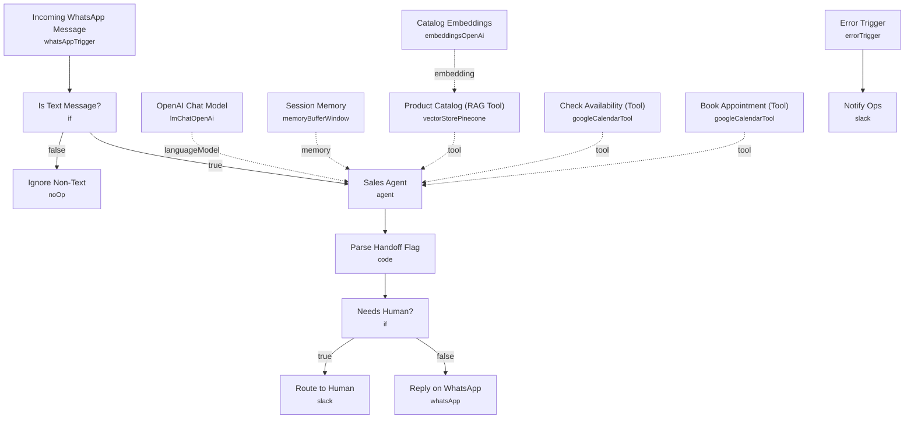

# WhatsApp AI Sales Agent

Every inbound WhatsApp message is handled by an AI sales agent that answers product questions using retrieval-augmented search over a Pinecone product catalog, checks calendar availability, and books appointments directly in Google Calendar. When the agent isn't confident in its answer, or the request falls outside its scope, the conversation is routed to a human in Slack instead of guessing.

Built for sales and support teams running WhatsApp as a primary sales channel who want instant, accurate product answers around the clock without losing complex conversations to a bot.

## What it does

1. **Incoming WhatsApp Message** triggers on new messages via the WhatsApp Business Cloud API.
2. **Is Text Message?** checks whether the message contains text.
   - If not, **Ignore Non-Text** is a no-op that ends the run for non-text messages (images, stickers, etc.).
   - If yes, the message goes to the **Sales Agent**.
3. **Sales Agent**, an AI agent backed by **OpenAI Chat Model** (GPT-5 mini) and **Session Memory** (buffer window keyed by the sender's phone number, 8-message window), answers using three tools:
   - **Product Catalog (RAG Tool)** — retrieves from a Pinecone vector index (embedded via **Catalog Embeddings**, OpenAI `text-embedding-3-small`) to answer product/pricing questions.
   - **Check Availability (Tool)** — checks Google Calendar free/busy for a given time range.
   - **Book Appointment (Tool)** — creates a Google Calendar event for confirmed appointments.
   The agent's system prompt instructs it to keep replies under 60 words and append `HANDOFF:true` or `HANDOFF:false` on its own line depending on confidence.
4. **Parse Handoff Flag** (Code node) strips the `HANDOFF` tag out of the reply text and sets a boolean `needsHuman` flag.
5. **Needs Human?** branches on that flag:
   - If true, **Route to Human** posts the customer's message and the agent's draft reply to a Slack channel for a human to take over.
   - If false, **Reply on WhatsApp** sends the agent's reply back to the customer directly.

## Sample request

This workflow is triggered by the WhatsApp Business Cloud webhook, not a custom one, so there's no request to construct by hand — Meta delivers a payload shaped like this when a customer messages your business number:

```json
{
  "messages": [
    {
      "from": "15551234567",
      "text": { "body": "Do you have the blue jacket in size M?" }
    }
  ]
}
```

## Setup (about 25 minutes)

1. **WhatsApp Business Cloud**: connect your account in *Incoming WhatsApp Message* and *Reply on WhatsApp*, and replace `REPLACE_WITH_PHONE_NUMBER_ID` in *Reply on WhatsApp* with your WhatsApp phone number id.
2. **OpenAI**: add your API key in *OpenAI Chat Model* and *Catalog Embeddings*.
3. **Pinecone**: connect your account in *Product Catalog (RAG Tool)* and set your index name (currently `REPLACE_WITH_PINECONE_INDEX`).
4. **Google Calendar**: connect your account in *Check Availability (Tool)* and *Book Appointment (Tool)*, and set the target calendar id (`REPLACE_WITH_CALENDAR_ID`) in both.
5. **Slack**: connect Slack OAuth2 in *Route to Human* and *Notify Ops*, and set the channel ids (`REPLACE_WITH_CHANNEL_ID`, labeled `whatsapp-handoffs` and `ops-alerts`) to your real channels.
6. All credential ids in this template are placeholders — replace every `REPLACE_WITH_CREDENTIAL_ID` before activating.

## Error handling

*Reply on WhatsApp* retries up to 2 times on failure. A dedicated **Error Trigger** catches any workflow failure and **Notify Ops** posts the failing error message to an ops Slack channel.

---

<!-- ARCHITECTURE:START -->
## Architecture


<!-- ARCHITECTURE:END -->
