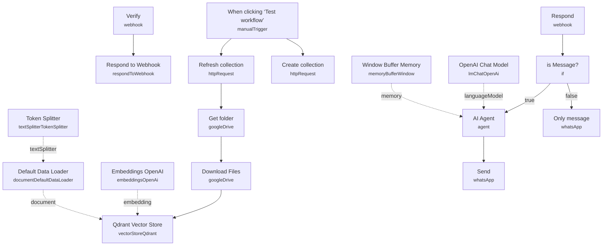

# Complete Business WhatsApp RAG Chatbot

A WhatsApp Business chatbot that answers customer questions about products and troubleshooting using a knowledge base embedded from Google Drive documents. It handles the full Meta webhook handshake (verification + message receiving) and replies only to text messages, politely declining anything else.

Built for retailers or support teams who want first-line WhatsApp support answered automatically from their own product documentation, with a human only needed for anything the knowledge base can't cover.

## What it does

**Webhook setup (runs continuously once deployed):**

1. **Verify** is a GET webhook that handles Meta's one-time webhook verification challenge.
2. **Respond** is the POST webhook that receives actual WhatsApp events (messages and status notifications) from Meta, sharing the same path as **Verify**.
3. **is Message?** (IF node) checks whether the payload contains an actual user message (`body.entry[0].changes[0].value.messages[0]`) versus a status-only notification.
   - If not a message, the branch ends (status notifications are ignored).
   - If it is a message, it proceeds to the agent.
4. **AI Agent** (conversational agent) reads the message text, powered by **OpenAI Chat Model** and **Window Buffer Memory** for context, with a system prompt tuned for an electronics store: answer with product info, troubleshooting steps, and support guidance, using the retrieved knowledge base.
5. **Only message** replies with "You can only send text messages" when the incoming message isn't plain text (image, audio, etc. fall through this path from the IF node's second output in practice, per the sticky note's description of the flow).
6. **Send** (WhatsApp node) sends the agent's `output` back to the same WhatsApp contact (`wa_id`) that sent the original message.

**Knowledge base ingestion (manual trigger, run separately):**

1. **When clicking 'Test workflow'** starts ingestion.
2. **Create collection** and **Refresh collection** are HTTP Request calls against the Qdrant REST API to create/clear the collection.
3. **Get folder** (Google Drive) lists files in a source folder; **Download Files** fetches each one (converting Google Docs to plain text).
4. **Qdrant Vector Store** (insert mode) embeds and stores the documents, using **Embeddings OpenAI** and **Token Splitter** + **Default Data Loader** to chunk and load content.

## Sample request

This workflow is driven by Meta's WhatsApp Cloud API webhook, not a request you'd normally craft by hand. A representative incoming payload to the **Respond** webhook looks like:

```json
{
  "entry": [{
    "changes": [{
      "value": {
        "messages": [{ "type": "text", "text": { "body": "Do you have wireless earbuds in stock?" } }],
        "contacts": [{ "wa_id": "15551234567" }]
      }
    }]
  }]
}
```

## Setup (~30 minutes)

1. **Meta WhatsApp Cloud API** — add WhatsApp API credentials to **Only message** and **Send**. Both nodes hardcode `phoneNumberId: 470271332838881` — replace it with your own WhatsApp Business phone number ID.
2. **Webhook configuration** — **Verify** and **Respond** must share the exact same path (already set to `f0d2e6f6-8fda-424d-b377-0bd191343c20` in this export, but you should regenerate/confirm it matches what you register). Set **Verify** to GET and **Respond** to POST in your n8n webhook settings, then register the production URL in the Meta for Developers app as the callback URL. Delete/disable **Verify** after the handshake succeeds if you prefer, per the workflow's own sticky note.
3. **OpenAI** — add your API key to **OpenAI Chat Model** and **Embeddings OpenAI**.
4. **Qdrant** — add API credentials (header auth) to **Create collection**, **Refresh collection**, and **Qdrant Vector Store**. Replace the `QDRANTURL` and `COLLECTION` placeholders visible in the HTTP Request URLs and the vector store's collection field.
5. **Google Drive** — add OAuth2 credentials to **Get folder** and **Download Files**, and point the folder filter at your own document source (currently set to a folder literally named `test-whatsapp`).
6. **Run ingestion first** — trigger **When clicking 'Test workflow'** once to populate Qdrant before going live, and re-run **Refresh collection** → **Get folder** → **Download Files** whenever source documents change.
7. **Rewrite the persona** — the **AI Agent** system prompt is written for an "electronics store"; adjust it to match your actual product line before deploying.

---

<!-- ARCHITECTURE:START -->
## Architecture


<!-- ARCHITECTURE:END -->
