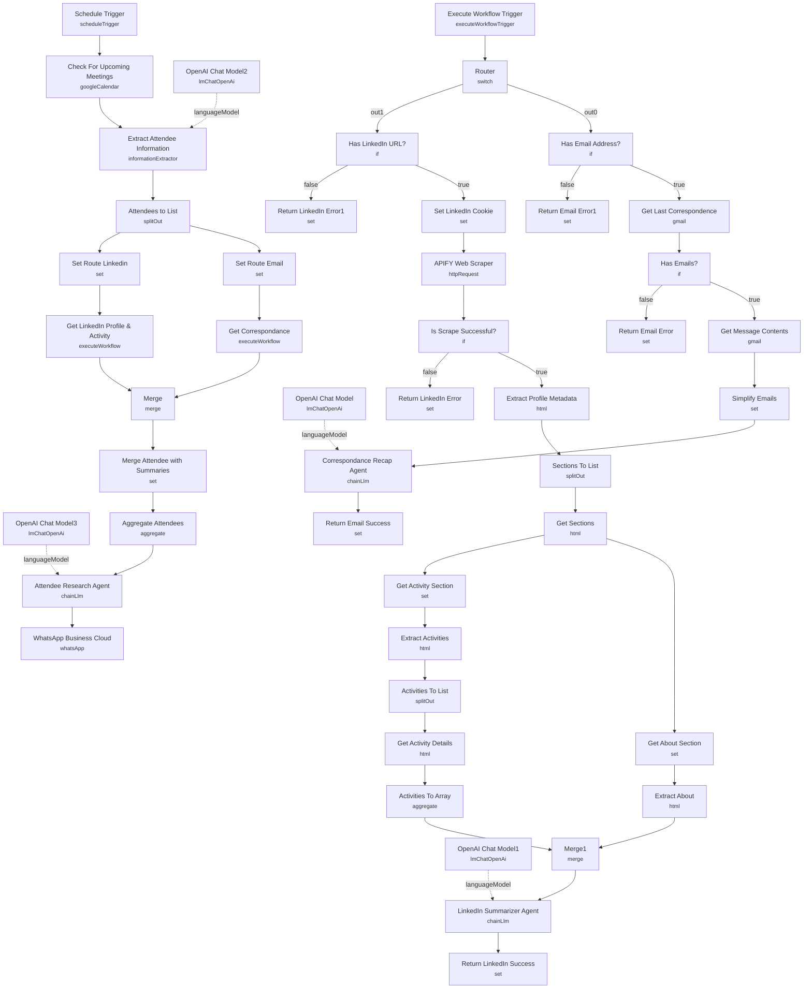

# AI Sales Meeting Prep via WhatsApp (Apify)

An hourly meeting-prep assistant that checks Google Calendar for meetings starting soon, researches each attendee's last email thread and LinkedIn activity, and sends a casual pre-meeting briefing to WhatsApp — bullet points on what was last discussed and fresh talking points, so the user never walks into a call cold.

Built for salespeople, founders, or consultants who take a lot of external meetings and want a five-second phone glance to replace ten minutes of manual digging through Gmail and LinkedIn before every call.

## What it does

**Main flow (calendar polling):**

1. **Schedule Trigger** runs hourly.
2. **Check For Upcoming Meetings** (Google Calendar, `getAll`, limited to 1) looks for the next event starting within the coming hour on a specific calendar (`n8n-events`).
3. **Extract Attendee Information** (LangChain Information Extractor, backed by **OpenAI Chat Model2**) parses the meeting's description/attendee list into a structured array of `{name, email, linkedin_url}` — it's designed to pick up LinkedIn URLs and names embedded in the invite's free-text description, since Google Calendar invites don't carry that natively.
4. **Attendees to List** splits the array into one item per attendee, then fans out into two parallel sub-workflow calls per attendee (self-calling this same workflow by `$workflow.id`):
   - **Set Route Email** tags the item `route: "email"` → **Get Correspondance** (Execute Workflow, mode `each`) re-enters this workflow's **Execute Workflow Trigger** → **Router**.
   - **Set Route Linkedin** tags the item `route: "linkedin"` → **Get LinkedIn Profile & Activity** (Execute Workflow, mode `each`) does the same.
5. **Merge** joins the email-summary and LinkedIn-summary results back together per attendee, **Merge Attendee with Summaries** combines them onto the attendee record, and **Aggregate Attendees** collapses everything into a single item holding an `attendees` array.
6. **Attendee Research Agent** (LLM chain, **OpenAI Chat Model3**) writes the actual briefing: meeting time/link/summary plus, per attendee, their last correspondence and LinkedIn talking points, in a casual SMS-style tone with bullet points.
7. **WhatsApp Business Cloud** sends the generated text to a fixed recipient number.

**Attendee Researcher sub-workflow (same file, entered via Execute Workflow Trigger):**

8. **Execute Workflow Trigger** → **Router** (switch on `route`) splits into two branches that never run together:
   - **Email branch:** **Has Email Address?** → **Get Last Correspondence** (Gmail, filtered by the attendee's email) → **Has Emails?** → **Get Message Contents** → **Simplify Emails** → **Correspondance Recap Agent** (LLM chain, **OpenAI Chat Model**) condenses the thread into a short recap → **Return Email Success**. Missing address or no emails found short-circuit to error nodes.
   - **LinkedIn branch:** **Has LinkedIn URL?** → **Set LinkedIn Cookie** (injects a hardcoded LinkedIn session cookie) → **APIFY Web Scraper** (HTTP request to Apify's `apify~web-scraper` actor, impersonating the user's own logged-in LinkedIn session) → **Is Scrape Successful?** → a chain of HTML-extraction nodes (**Extract Profile Metadata**, **Sections To List**, **Get About Section**/**Get Activity Section**, **Extract About**/**Extract Activities**, **Activities To List**, **Get Activity Details**, **Activities To Array**) pulls the profile's About and recent Activity sections → **Merge1** joins them → **LinkedIn Summarizer Agent** (LLM chain, **OpenAI Chat Model1**) writes a short "recent activity" summary → **Return LinkedIn Success**. A missing URL or failed scrape short-circuits to error nodes.

## Sample input

There's no webhook — the workflow is entirely schedule- and calendar-driven. The trigger event is simply a Google Calendar event containing attendee context in its description, e.g.:

```
Summary: Renewal call - Acme Corp
Description: Quarterly renewal discussion with Jane Doe (jane@acmecorp.com, linkedin.com/in/janedoe)
Attendees: jane@acmecorp.com, you@yourcompany.com
Start: 2026-07-08T15:00:00Z
Hangout Link: https://meet.google.com/abc-defg-hij
```

The final WhatsApp message reads roughly like a friendly text: "Heads up — call with Jane at 3pm today (link). Last time you two talked about the Q2 renewal terms... Jane's been posting about..." etc.

## Setup (~45 minutes)

1. **Google Calendar** — add `googleCalendarOAuth2Api` to **Check For Upcoming Meetings**, and replace the hardcoded calendar ID (`c_5792bdf...@group.calendar.google.com`, cached as "n8n-events") with your own calendar.
2. **OpenAI** — add `openAiApi` to **OpenAI Chat Model**, **OpenAI Chat Model1**, **OpenAI Chat Model2**, and **OpenAI Chat Model3** (used respectively by the email recap agent, LinkedIn summarizer, attendee information extractor, and the final briefing writer).
3. **Gmail** — add `gmailOAuth2` to **Get Last Correspondence** and **Get Message Contents** so the email branch can search and read the attendee's last thread.
4. **Apify** — add an `httpQueryAuth` credential ("Apify API") to **APIFY Web Scraper**. This uses Apify's generic `web-scraper` actor (not a purpose-built LinkedIn scraper) driven by a custom `pageFunction`, so no extra actor setup is needed beyond an Apify account and API token.
5. **LinkedIn session cookie (critical, hardcoded placeholder)** — **Set LinkedIn Cookie** has a literal `<COPY_YOUR_LINKEDIN_COOKIES_HERE>` placeholder for `linkedin_cookies`; you must paste your own `li_at` session cookie value here for the scraper to authenticate as you. The workflow's own sticky notes warn this risks violating LinkedIn's Terms of Service — consider using a secondary/throwaway account rather than your primary one.
6. **WhatsApp Business Cloud** — add `whatsAppApi` to **WhatsApp Business Cloud**, and replace the hardcoded `phoneNumberId` (`477115632141067`) and `recipientPhoneNumber` (`44123456789`) with your own sender ID and recipient.
7. **Self-referencing sub-workflow** — **Get Correspondance** and **Get LinkedIn Profile & Activity** both call `{{ $workflow.id }}` (this same workflow) via its **Execute Workflow Trigger**. Don't duplicate or re-import this workflow under a new ID without also checking those references still resolve.
8. Tune the **Schedule Trigger** interval and the `timeMax`/`timeMin` window in **Check For Upcoming Meetings** (currently "next hour") to match how far ahead you want your heads-up notification.

---

<!-- ARCHITECTURE:START -->
## Architecture


<!-- ARCHITECTURE:END -->
