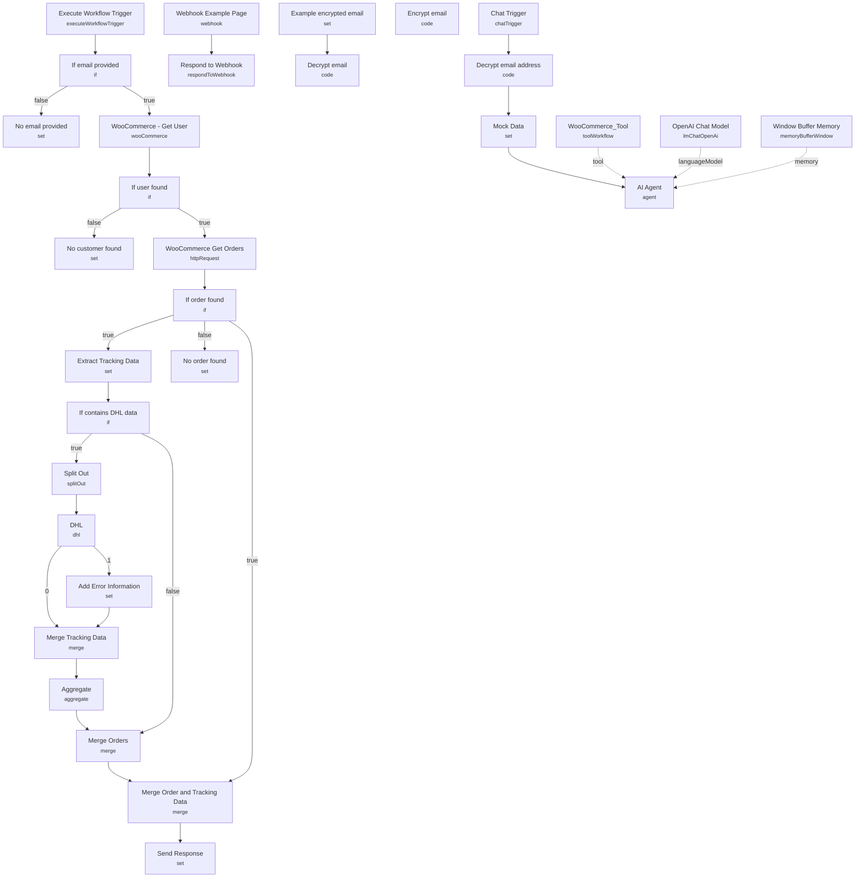

# WooCommerce AI Support Agent

A chat-based customer support agent for a WooCommerce store that can look up a customer's orders and DHL shipment tracking without exposing other customers' data. The agent identifies the requester by an email address that is encrypted client-side and decrypted inside the workflow, then answers questions about order status, dispatch timing, and delivery tracking directly in an embeddable chat widget.

Built for store owners who want to deflect "where is my order" tickets with an AI agent that only ever sees the requesting customer's own orders.

## What it does

1. **Chat Trigger** opens a public n8n chat session and receives the customer's message plus a `metadata.email` field.
2. **Decrypt email address** (disabled by default) reverses an AES-256-CBC encryption applied server-side on the website, so the true email never travels in plain text. **Mock Data** stands in for this during testing, hardcoding `james@brown.com`.
3. **AI Agent** (backed by **OpenAI Chat Model**, GPT-4, with **Window Buffer Memory** keyed on the chat session) answers using a system prompt tailored to "Best Shirts Ltd.", covering dispatch timing (1-2 days), delivery timing, and a hard rule that it can never use an email other than the one in `metadata.email`.
4. The agent's only tool is **WooCommerce_Tool**, an `@n8n/n8n-nodes-langchain.toolWorkflow` node that calls this same workflow again (`$workflow.id`) via its **Execute Workflow Trigger**, passing the email and an optional comma-separated list of order IDs.
5. Inside the sub-workflow call: **If email provided** gates on a non-empty email, then **WooCommerce - Get User** looks up the WooCommerce customer by email. **If user found** branches to **WooCommerce Get Orders** (an HTTP Request node hitting `/wp-json/wc/v3/orders`, filtered by `customer` ID and the requested order IDs) or to **No customer found**.
6. **If order found** checks the result set; on success it fans out to **Extract Tracking Data** (pulls the `_wc_shipment_tracking_items` meta field) and to **Merge Order and Tracking Data**, otherwise it returns **No order found**.
7. **If contains DHL data** decides whether tracking numbers exist; if so, **Split Out** breaks out each tracking entry and calls the **DHL** node (with `continueErrorOutput` so a bad tracking ID doesn't kill the run — routed instead to **Add Error Information**). Results are aggregated (**Merge Tracking Data** → **Aggregate**) and recombined with the original orders via **Merge Orders** and **Merge Order and Tracking Data** (positional merge).
8. **Send Response** flattens everything into a single `response` array that the tool returns to the AI Agent, which then answers the customer in natural language.

A separate **Webhook Example Page** / **Respond to Webhook** pair (unconnected to the main flow trigger-wise, but included as reference) serves a static HTML page demonstrating how to embed the `@n8n/chat` widget with the encrypted email in its `metadata`.

## Sample request

This uses n8n's embeddable chat widget, not a raw webhook body. The website script initializes it like this:

```js
createChat({
  webhookUrl: 'https://xxx.n8n.cloud/webhook/ea429912-869c-490b-9e04-4401ac9943b6/chat',
  metadata: {
    email: '352b16c74f73265441c55c37c9c22b04:4a8e614143c9cd31cc7e2389380943f3', // AES-256-CBC encrypted email
  },
});
```

A customer then simply types something like:

```
Has my last order shipped yet?
```

## Setup (~20 minutes)

1. **WooCommerce** — add a WooCommerce API credential to **WooCommerce - Get User** and **WooCommerce Get Orders**. The order-lookup HTTP node has the store URL (`woo-pleasantly-swag-werewolf3.wpcomstaging.com`) hardcoded — change it to your store's REST API base URL.
2. **DHL** — add a DHL API credential to the **DHL** node, or replace it with your own carrier's node (UPS is a common alternative) if you don't ship via DHL.
3. **OpenAI** — add an API key to **OpenAI Chat Model**.
4. **Encryption password** — the `Decrypt email address`, `Encrypt email`, and `Decrypt email` (example) Code nodes all hardcode `'a random password'` for AES key derivation. Replace it with a real shared secret used identically in your website backend, and keep the backend encryption logic in sync with the `decrypt()` function in this workflow.
5. **Go live** — disable/delete **Mock Data**, enable **Decrypt email address**, and enable the workflow. Until then, `Mock Data` overrides the email with `james@brown.com` regardless of what the chat sends, which is convenient for testing but must be turned off before production traffic hits it.
6. **Self-referencing tool** — **WooCommerce_Tool** calls `$workflow.id`, i.e. this same workflow, through **Execute Workflow Trigger**. Don't rename or duplicate the workflow without updating that reference.

---

<!-- ARCHITECTURE:START -->
## Architecture


<!-- ARCHITECTURE:END -->
