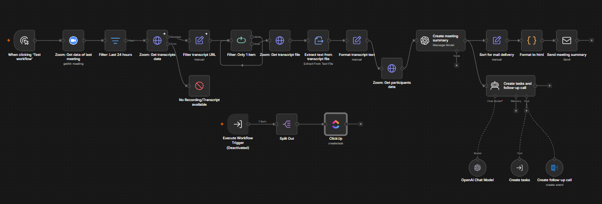
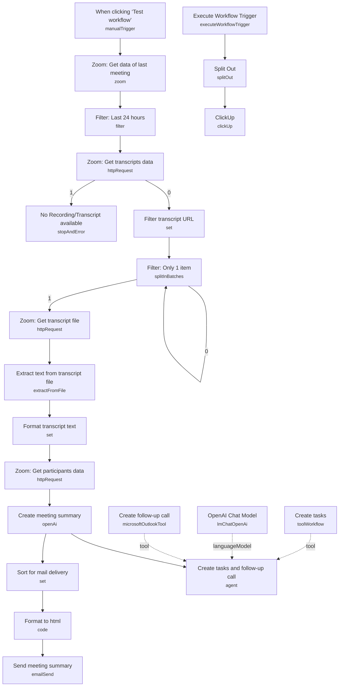

# Zoom AI Meeting Assistant (ClickUp)

<!-- CANVAS:START -->

<!-- CANVAS:END -->

Pulls the transcript from a recently finished Zoom meeting, generates formal meeting minutes, emails them to attendees, and lets an AI agent extract action items into ClickUp tasks and schedule an Outlook follow-up call — all from a single trigger.

Built for anyone who runs recurring Zoom calls and wants minutes, tasks, and next-meeting scheduling generated automatically instead of typed up by hand afterward.

## What it does

1. **When clicking 'Test workflow'** (manual trigger — swap for a schedule or webhook in production) starts the run.
2. **Zoom: Get data of last meeting** lists all scheduled meetings via the Zoom API, and **Filter: Last 24 hours** keeps only meetings that started within the last day.
3. **Zoom: Get transcripts data** requests the meeting's recording files; if this errors (no recording exists), it routes to **No Recording/Transcript available**, a Stop-and-Error node that surfaces the failure cause.
4. **Filter transcript URL** extracts the `TRANSCRIPT` file's `download_url` from the recording files array.
5. **Filter: Only 1 item** (a SplitInBatches node used as a single-item gate) ensures only one meeting is processed per run, then **Zoom: Get transcript file** downloads the actual transcript file.
6. **Extract text from transcript file** pulls plain text out of the downloaded file, and **Format transcript text** (Code node) strips VTT-style timestamp/index blocks, leaving clean dialogue text.
7. **Zoom: Get participants data** calls the Zoom API for the meeting's attendee list (name + email).
8. **Create meeting summary** (OpenAI, GPT-4o) turns the transcript, participant list, and meeting date into formatted minutes: a summary, a task list, and important dates.
9. **Sort for mail delivery** maps the output into `subject`, `to` (the first participant's email), and `body`, and **Format to html** (Code node) parses the minutes' sections and renders them as styled HTML.
10. **Send meeting summary** emails the formatted minutes via SMTP.
11. In parallel, **Create tasks and follow-up call** is an AI agent (OpenAI Functions agent on **OpenAI Chat Model**, GPT-4o) with a strict system prompt instructing it to extract action items assigned to the meeting owner and identify any mentioned follow-up meeting. It has two tools: **Create tasks** (a Tool Workflow node calling a separate `create_task` sub-workflow, which internally uses **Split Out** and **ClickUp** to create ClickUp tasks from an `items` array) and **Create follow-up call** (a Microsoft Outlook tool node that creates a calendar event using `$fromAI()`-extracted meeting name, start, and end time).

## Setup (~25 minutes)

1. **Zoom** — add an OAuth2 credential to **Zoom: Get data of last meeting**, **Zoom: Get transcripts data**, **Zoom: Get transcript file**, and **Zoom: Get participants data**. The Zoom account must have cloud recording with transcription enabled for meetings you want summarized.
2. **OpenAI** — add API credentials to **OpenAI Chat Model** and **Create meeting summary** (both use GPT-4o by default).
3. **SMTP** — add credentials to **Send meeting summary**, and replace the hardcoded `fromEmail` (`friedemann.schuetz@posteo.de`) with your own sending address.
4. **Microsoft Outlook** — add an OAuth2 credential to **Create follow-up call**, and replace the hardcoded `calendarId` with your own calendar's ID.
5. **ClickUp** — add an OAuth2 credential to the **ClickUp** node inside the `create_task` sub-workflow, and replace the hardcoded `list`, `team`, `space`, and `folder` IDs with your own ClickUp workspace's IDs.
6. **Sub-workflow reference** — **Create tasks** (the Tool Workflow node) points at a separate workflow by ID (`zSKQLEObdU9RiThI`, cached name `create_task`); after importing, re-select the actual sub-workflow in your instance so the ID resolves correctly, and ensure that sub-workflow's **Execute Workflow Trigger** and **Split Out** (splitting `query.items`) are intact.
7. **24-hour window filter** — **Filter: Last 24 hours** only processes meetings that started within the last day; if you're testing against an older meeting, either adjust the filter or trigger the workflow soon after the call ends.
8. **Single-meeting assumption** — the pipeline is built around processing one meeting per run (**Filter: Only 1 item**); if multiple meetings finished in the same 24-hour window, only one will be summarized per execution.

---

<!-- ARCHITECTURE:START -->
## Architecture

<!-- ARCHITECTURE:END -->
